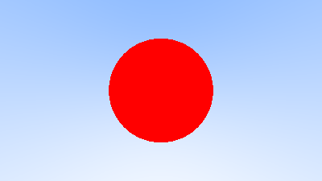
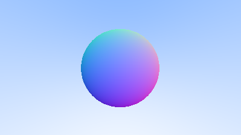
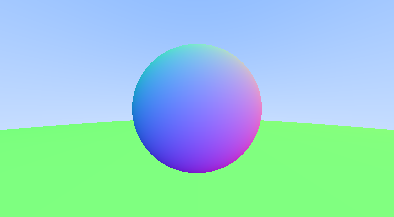
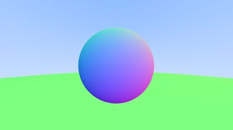
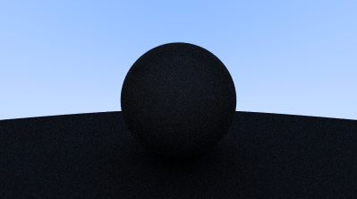
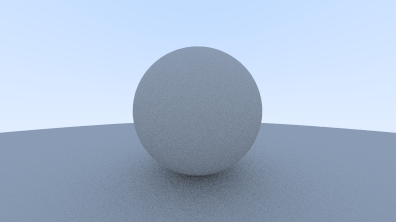
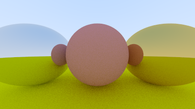
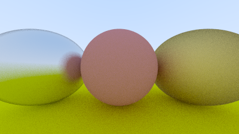
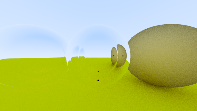

# landela-ilanga

Ray tracer but in [Xhosa](https://translate.google.com/?sl=xh&tl=en&text=landela%20ilanga&op=translate), based off of [Ray Tracing in One Weekend](https://raytracing.github.io/books/RayTracingInOneWeekend.html)

## Progress

**1-3**: Generate PPM image

**4**: Ray based gradient image

**5**: Ray & sphere intersection, **6.1**: Compute normals, **6.7**: Multi object support, **7**: Antialiasing

**8.2** First render of a diffuse sphere, **8.6** Gamma corrected diffuse sphere

**9.5** Specular reflection, **9.6** Fuzzed metal material

**10.2** Dielectric that always refracts

