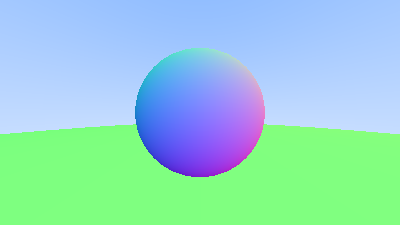
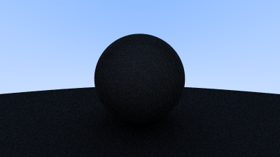

# landela-ilanga

Ray tracer but in [Xhosa](https://translate.google.com/?sl=xh&tl=en&text=landela%20ilanga&op=translate), based off of [Ray Tracing in One Weekend](https://raytracing.github.io/books/RayTracingInOneWeekend.html)

## Progress

1-3: Generate PPM image

4: Ray based gradient image

5: Ray & sphere intersection

6.1: Sphere normals

6.7: Sphere normals with ground

7: Antialiasing

8.2 First render of a diffuse sphere

